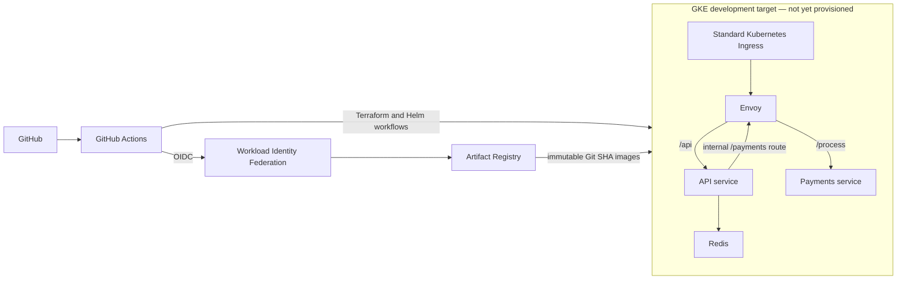
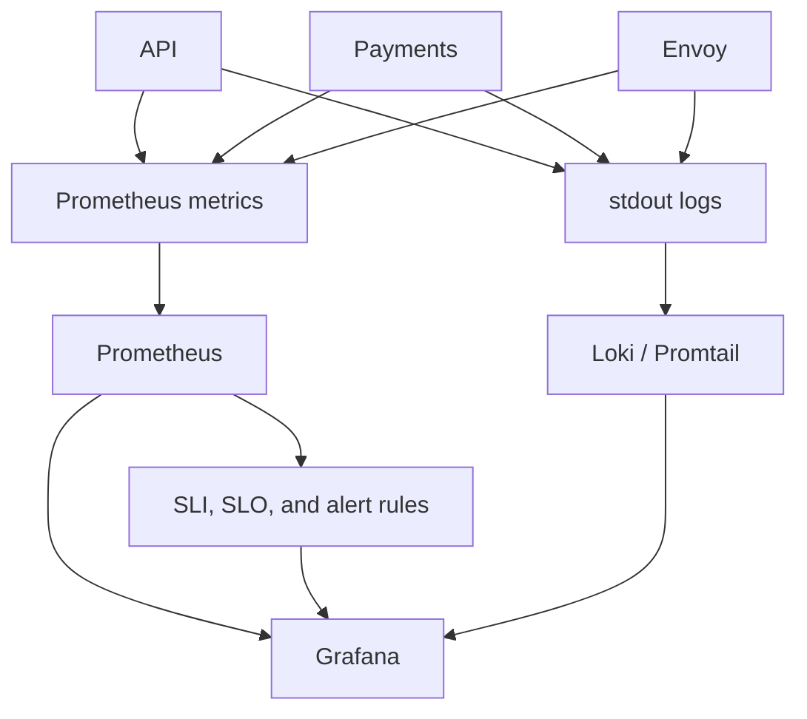
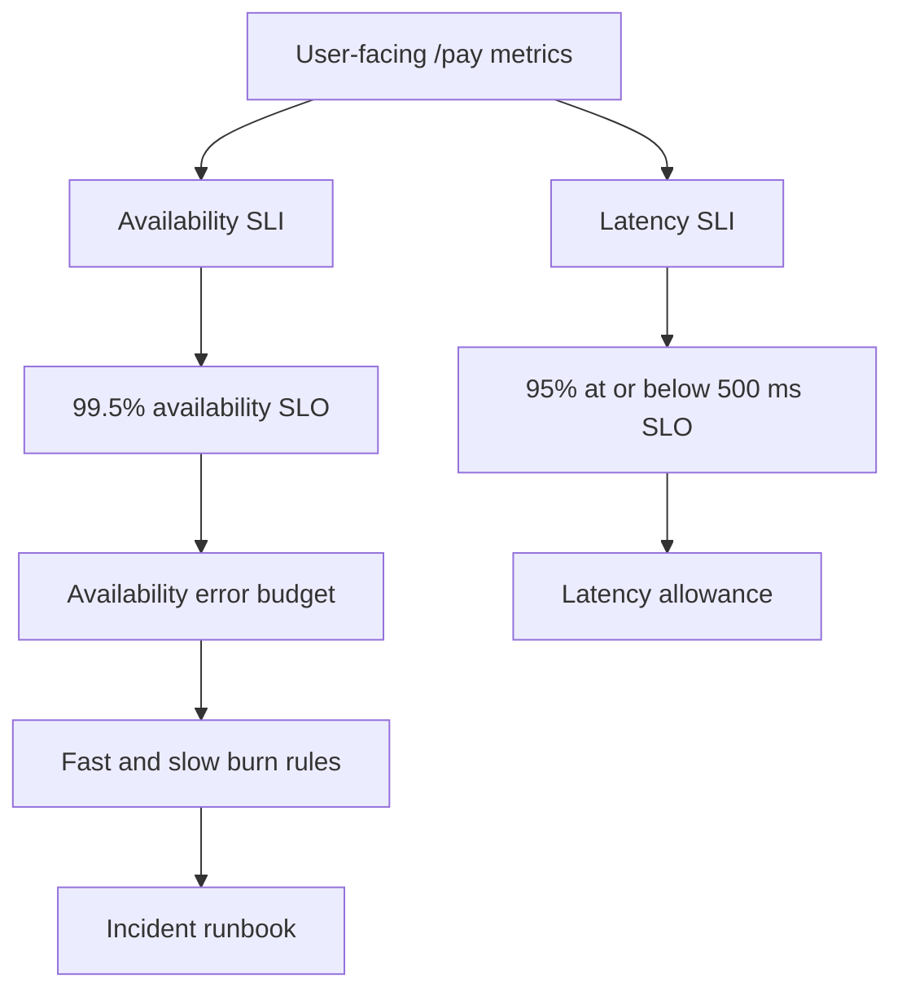
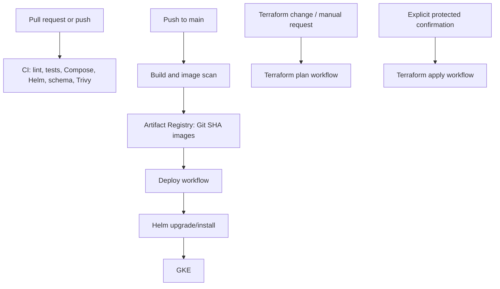
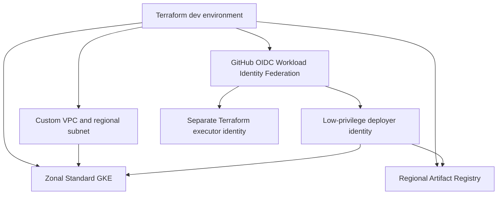

# Cloud-Native Reliability Engineering Platform

A deliberately small, reproducible SRE portfolio platform for learning how a user-facing payment workflow behaves under load, dependency failure, and Kubernetes disruption.

> **Project status — implementation in progress.** The repository contains the application, Helm, Terraform, GitHub Actions, observability, SLO, and operational configuration described below. Local lint/unit/Compose API-flow/integration checks, Terraform format/validation, and Helm lint/template rendering have passed. There is **no live GKE deployment, alert delivery, controlled-incident result, or GKE evidence captured in this repository yet**.

| Status | Meaning in this README |
| --- | --- |
| **Implemented** | Source code or reusable configuration is present in the repository. |
| **Configured** | An environment-dependent manifest, workflow, dashboard, or procedure is defined, but needs execution in its target environment. |
| **Validated locally** | A local/static check has succeeded; it is not evidence of a GKE outcome. |
| **Not yet validated** | No timestamped execution evidence exists for the stated environment or behavior. |

The dated [current-state audit](docs/audit/current-state-audit.md) is the baseline for this work; the [implementation plan](docs/implementation-plan.md) explains the target design and constraints. The [evidence ledger](docs/evidence/README.md) is intentionally empty until real results are captured.

## Overview

The platform has one intentionally understandable request path:

```text
caller → Ingress → Envoy → API POST /pay → Envoy internal route → Payments POST /process
                                  └──────────────────────────────→ Redis rate-limit state
```

That small path is enough to make SRE trade-offs visible. A Payments fault can affect caller-facing success and latency, appear in proxy and application signals, consume an error budget, trigger a configured alert, and be investigated with a runbook. The point is not to imitate a large production estate; it is to make each reliability decision inspectable and testable.

## Why This Project Exists

Most demo deployments stop after a healthy response. This project focuses on the operational questions that begin after deployment:

- Which signal represents what a caller actually experiences?
- How do retries and timeouts protect a dependency without amplifying its failure?
- How do HPA, PDBs, probes, and NetworkPolicies change a failure's blast radius?
- How is a configured SLO turned into evidence from a controlled incident?

The expected end state is a short-lived, cost-conscious GKE development environment—not a multi-region production platform. Its success criterion is reproducible evidence, not impressive-sounding claims.

## What I Focused On

| Focus | Current state |
| --- | --- |
| Small distributed workload | **Implemented** — FastAPI API and Payments services, with Redis-backed tenant rate limiting. |
| Reliability boundary | **Configured** — Helm-managed Envoy routes, bounded retry/backoff, timeouts, circuit-breaker limits, and outlier detection. |
| Kubernetes resilience | **Configured** — probes, resource requests/limits, HPA, PDB, default-deny NetworkPolicies, and release-safe names. |
| Observability and SRE model | **Configured** — user-facing metrics, dashboards, ServiceMonitors, Prometheus rules, two SLO definitions, error-budget calculations, and burn alerts. |
| GCP delivery | **Implemented** — Terraform modules plus keyless GitHub OIDC/Workload Identity workflows. |
| Proof of operation | **Not yet validated** — no live GKE, alert, load, eviction, fault, or recovery evidence is committed. |

## Architecture

The diagram shows the configured target architecture, not deployed infrastructure.



The Helm chart remains at [`deploy/helm/`](deploy/helm/) and deploys Envoy alongside the API, Payments, and Redis. The API's in-cluster Payments URL points at Envoy's internal `/payments` route so dependency resilience policy is in the request path. Payments storage is intentionally in memory, so records are lost when a replica restarts; this is a reliability-learning workload, not a durable payment system.

## Technology Stack

| Layer | Components | State |
| --- | --- | --- |
| Services | Python 3.11, FastAPI, HTTPX, Prometheus client | **Implemented** |
| Dependency/rate-limit state | Redis sliding-window, per-tenant limiter | **Implemented** |
| Traffic resilience | Envoy, retries, exponential backoff, timeouts, circuit-breaker limits, outlier detection | **Configured** |
| Kubernetes packaging | Helm, Ingress, probes, HPA, PDB, NetworkPolicies, quotas | **Configured** |
| Metrics and dashboards | Prometheus-compatible metrics, ServiceMonitors, PrometheusRule, Grafana dashboard JSON | **Configured** |
| Logs | stdout application/proxy logs; Loki values and LogQL guidance | **Configured** |
| Infrastructure | Terraform for VPC, zonal Standard GKE, Artifact Registry, GitHub WIF | **Implemented**; **Validated locally** with `terraform fmt` and `terraform validate` |
| Delivery | GitHub Actions CI, image build/scan/push, deployment, Terraform plan/apply | **Configured** |

## Distributed Workload

`POST /api/pay` is the canonical user journey. Envoy removes the `/api` prefix, the API validates the request and records user-facing SLO metrics for `/pay`, then calls Payments through Envoy's internal route. Redis tracks the caller's tenant window for rate limiting.

Operational endpoints (`/healthz`, `/readyz`, and `/metrics`) are excluded from the user-facing SLI by design. API readiness checks Redis; Payments readiness reflects that the intentionally in-memory service has no external persistence dependency.

## Reliability Patterns

| Pattern | Configuration | Status and validation boundary |
| --- | --- | --- |
| Retry and exponential backoff | Envoy has two retries for selected upstream failures, with bounded base/max backoff. | **Configured**; retry counters and user-path behavior are **not yet validated**. |
| Timeout | Envoy uses a 200 ms per-try timeout within a 2 s request timeout; the API also bounds its HTTP client call. | **Configured**; timeout behavior through GKE is **not yet validated**. |
| Circuit breaker | Envoy limits connections, pending requests, active requests, and retries. | **Configured**; overflow/bounded-load behavior is **not yet validated**. |
| Outlier detection | Consecutive upstream 5xx responses can eject an unhealthy endpoint from the pool. | **Configured**; meaningful validation needs multiple Payments replicas and captured ejection counters. |
| Bulkhead | The Envoy request/connection limits are the configured downstream bulkhead. | **Configured**; a focused load test and counters are **not yet validated**. |
| Rate limiting | Redis-backed sliding-window limit defaults to 60 requests per tenant per 60 seconds and returns `429` when exceeded. | **Implemented**; a canonical [`tests/load/rate-limit.js`](tests/load/rate-limit.js) procedure is present, but no current cluster result is captured. |

These protections are deliberately bounded. A retry policy without timeouts and limits can make a struggling dependency worse rather than safer.

## Kubernetes Reliability

| Control | Design | Status |
| --- | --- | --- |
| Health probes | API and Payments expose liveness (`/healthz`) and readiness (`/readyz`) endpoints; Envoy has admin health probes. | **Implemented/configured**; live readiness behavior is **not yet validated**. |
| HPA | API HPA is configured for 1–3 replicas with a 65% CPU target and resource requests. | **Configured**; no measured scale-up/down has been captured. |
| PDB | API, Payments, and Envoy PDBs use `minAvailable: 1`; Payments defaults to two replicas for an eviction experiment. | **Configured**; a direct pod deletion is not PDB validation. Use the [PDB eviction runbook](docs/runbooks/pdb-eviction-test.md). |
| NetworkPolicies | Default ingress/egress deny plus explicit DNS, ingress-to-Envoy, Envoy-to-services, API-to-Envoy/Redis, and monitoring paths. | **Configured**; GKE policy enforcement/connectivity is **not yet validated**. |
| Security context | Workloads use non-root execution, read-only filesystems where applicable, dropped capabilities, no privilege escalation, seccomp defaults, and no service-account token mounting where it is unnecessary. | **Configured**; runtime policy admission is **not yet validated**. |

## Observability



### Golden Signals

The [`SRE Service Overview` dashboard](deploy/helm/dashboards/sre-service-overview.json) is configured to bring traffic, errors, latency, and saturation into one view. The Grafana dashboard JSON is included in the Helm release; a dashboard render against a running Grafana instance is **not yet validated**.

### Metrics

The API emits bounded-label, user-facing metrics only for `/pay`:

- `sre_api_user_requests_total{status_class=...}`
- `sre_api_user_request_duration_seconds{status_class=...}`

Prometheus `ServiceMonitor` and `PrometheusRule` resources are optional Helm features because they require a compatible Prometheus Operator installation. They are **configured**, not proven by a live scrape/target/rule result. See [SLOs and Error Budgets](docs/sre/slo-and-error-budget.md) for the metric contract and query definitions.

### Logs

API rate-limit events include tenant and request context in stdout logs, while Envoy is configured to write access logs to stdout. Loki values and LogQL guidance are present, but log ingestion/query evidence from a GKE environment is **not yet captured**.

## SRE Model

### SLIs and SLOs

Exactly two primary SLOs are defined for the caller-facing `/pay` operation:

| SLO | Target | SLI | Status |
| --- | ---: | --- | --- |
| Availability | 99.5% successful, non-5xx `/pay` responses | good user requests ÷ all instrumented user requests | **Configured**; no retained Prometheus result yet |
| Latency | 95% of `/pay` requests at or below 500 ms | observations in the `≤0.5s` histogram bucket ÷ all observations | **Configured**; no retained Prometheus result yet |

### Error Budget and Burn Rate

The availability objective permits a 0.5% error budget: at 10,000 qualifying requests, 50 server-error responses fit within the budget. Budget remaining/consumed recording rules and fast/slow burn alerts are included in the optional PrometheusRule. A current SLI, budget value, or alert result would require real data and is therefore **not yet validated**.



Read the full [SLO and error-budget design](docs/sre/slo-and-error-budget.md) before treating a dashboard panel or rule as proof.

## Failure Engineering

The repository includes focused k6 scenarios for a baseline, rate limiting, HPA pressure, latency faults, and error faults under [`tests/load/`](tests/load/). It also includes reversible fault helpers in [`scripts/fault-inject.sh`](scripts/fault-inject.sh) and [`scripts/fault-cleanup.sh`](scripts/fault-cleanup.sh).

These files are a **configured test procedure**, not evidence that the test passed. Fault injection can affect workloads and may need explicit capabilities/chaos values, so run it only in an approved non-production namespace. Capture the baseline, fault, cleanup, and recovery using the [evidence standard](docs/evidence/README.md).

## Incident Walkthrough

The showcase exercise is a controlled Payments failure or latency degradation. It has a [high-payment-error runbook](docs/runbooks/high-payment-error-rate.md), a [postmortem template](docs/postmortems/payment-degradation.md), and a dedicated evidence location. It has **not yet been executed as an evidenced incident**.

```mermaid
flowchart LR
    Baseline[Capture baseline] --> Fault[Introduce one reversible Payments fault]
    Fault --> Observe[Observe user SLI, budget, and alert state]
    Observe --> Diagnose[Correlate metrics, logs, Envoy, and Kubernetes]
    Diagnose --> Mitigate[Cleanup fault or roll back]
    Mitigate --> Recover[Verify user-path recovery]
    Recover --> Evidence[Save timestamped evidence]
    Evidence --> Postmortem[Complete postmortem and action items]
```



If an expected alert does not fire, that is a useful validation result: record the blind spot, fix it, and repeat the exercise. Do not replace it with a success claim.

## CI/CD



The workflows are defined under [`.github/workflows/`](.github/workflows/):

- [`ci.yml`](.github/workflows/ci.yml) validates Python, Compose API flow, Helm rendering, Kubernetes schema, and filesystem vulnerabilities.
- [`build-images.yml`](.github/workflows/build-images.yml) authenticates through GitHub OIDC, scans service images, and publishes immutable Git-SHA tags to Artifact Registry.
- [`deploy.yml`](.github/workflows/deploy.yml) deploys the SHA-tagged images with Helm after required repository variables are configured.
- [`terraform-plan.yml`](.github/workflows/terraform-plan.yml) and [`terraform-apply.yml`](.github/workflows/terraform-apply.yml) separate review from an explicit apply confirmation.

This is **configured delivery**, not a claim that a workflow, registry push, or GKE deployment has completed. The design does not use stored JSON service-account keys.

## GCP Infrastructure



Terraform composes [`network`](terraform/modules/network/), [`gke`](terraform/modules/gke/), [`artifact-registry`](terraform/modules/artifact-registry/), and [`github-wif`](terraform/modules/github-wif/) modules through [`terraform/environments/dev`](terraform/environments/dev/). The configuration creates a cost-conscious zonal cluster and a 2–3 node pool so a PDB experiment is possible.

**Validated locally:** Terraform formatting and `terraform validate` have passed. **Not yet validated:** a cloud plan/apply, Workload Identity bootstrap, image publishing, cluster provisioning, and teardown. Those operations need a billing-enabled project, bootstrap IAM, real GitHub/project inputs, and a deliberate remote-state decision. See the [Terraform guide](terraform/README.md).

## Security

- GitHub Actions uses OIDC/Workload Identity configuration instead of a stored service-account key.
- Application and proxy manifests configure non-root execution, restrictive container security settings, and disabled service-account token mounting where possible.
- NetworkPolicies are default-deny with explicit traffic paths.
- CI includes filesystem and image scanning gates through Trivy configuration.
- Terraform examples, Helm values, and environment examples contain placeholders rather than project IDs, credentials, or registry secrets.

Security configuration is **implemented/configured**. It is not a certification, threat model, or proof of security in a live environment.

## Evidence

The [evidence ledger](docs/evidence/README.md) defines the required capture for CI, Terraform, GKE, observability, HPA, PDB, resilience, SLO, and incident exercises. Its empty categories mean **not yet captured**, not passed or failed.

| Area | Evidence currently available |
| --- | --- |
| Terraform static configuration | Local `fmt`/`validate` success is known; no cloud plan/apply artifact is committed. |
| Helm static configuration | Local lint/template rendering has passed; no installed-release artifact is committed. |
| GKE, HPA, PDB, NetworkPolicy | **Not yet validated** in a live cluster. |
| Prometheus, Grafana, Loki, alert routing | **Not yet validated** with live targets, queries, dashboards, or alert delivery. |
| Fault, load, recovery, postmortem | **Not yet validated**; procedures and templates are ready. |

Historical local-lab screenshots and outputs are not presented as current GKE proof. New results should be timestamped, redacted, linked from the appropriate runbook/postmortem, and stored under [`docs/evidence/`](docs/evidence/).

## Repository Structure

```text
.
├── services/                 # API and Payments FastAPI services
├── deploy/
│   ├── helm/                 # Application chart, Envoy, policies, dashboards, SLO rules
│   ├── prometheus/           # Existing monitoring-stack configuration
│   ├── loki/                 # Existing Loki values
│   └── envoy/                # Retired standalone-manifest migration note
├── terraform/
│   ├── modules/              # Network, GKE, Artifact Registry, GitHub WIF
│   └── environments/dev/     # Small development foundation
├── tests/load/               # Focused k6 procedures
├── scripts/                  # Fault and operational helpers
├── docs/
│   ├── audit/                # Dated baseline audit
│   ├── evidence/             # Evidence ledger and capture locations
│   ├── interview/            # Evidence-aware interview talk tracks
│   ├── postmortems/          # Controlled-incident template
│   ├── runbooks/             # Operating procedures
│   └── sre/                  # SLI/SLO/error-budget design
└── .github/workflows/        # CI, delivery, and Terraform workflows
```

## Deployment Guide

### 1. Run the application locally

Local Compose is useful for development; it is not a substitute for Envoy, Kubernetes policy, or GKE validation.

```bash
make install
make dev

curl --fail --show-error \
  --header 'Content-Type: application/json' \
  --header 'X-Tenant: local' \
  --data '{"amount": 100, "currency": "USD", "tenant_id": "local"}' \
  http://localhost:8000/pay

make down
```

Use [`.env.example`](.env.example) as a safe starting point for local configuration. Payments is in-memory, so do not use the response as a persistence guarantee.

### 2. Render or deploy to a local Kubernetes cluster

Build local images into the image runtime used by the chosen local cluster, then use the portable example values:

```bash
docker build -f services/api/Dockerfile -t cloud-native-sre-platform-api:dev .
docker build -f services/payments/Dockerfile -t cloud-native-sre-platform-payments:dev .

helm dependency build deploy/helm
helm upgrade --install cloud-native-sre-platform deploy/helm \
  --namespace sre-platform \
  --create-namespace \
  --values deploy/helm/values-dev.example.yaml
```

The local-values example disables Ingress, NetworkPolicies, and Prometheus resources because their prerequisites vary by cluster. Re-enable and validate them deliberately rather than assuming local behavior matches GKE.

### 3. Provision and deploy to GCP

Follow the [Terraform bootstrap guide](terraform/README.md) to create a real `terraform.tfvars`, initialize the intended backend, review a plan, and apply only in an approved billing-enabled project. Then set the documented GitHub Actions variables from Terraform outputs. The deployment workflow supplies immutable image repository and Git-SHA values to Helm.

Ingress class, hostname, TLS, Prometheus Operator installation, Grafana, Loki, and alert routing are environment decisions. They are intentionally not claimed as ready until the target environment is configured and evidence is collected.

## Validation Guide

Start with safe local checks. Run only the commands whose prerequisites are available, and retain the real output when a result will be used as evidence.

```bash
# Python checks
make lint
make test

# Helm static checks
helm dependency build deploy/helm
helm lint deploy/helm --strict
helm template cloud-native-sre-platform deploy/helm \
  --namespace sre-platform > rendered-manifests.yaml

# Terraform static checks; no cloud resources are changed
terraform -chdir=terraform/environments/dev init -backend=false -input=false
terraform -chdir=terraform/environments/dev fmt -check -recursive
terraform -chdir=terraform/environments/dev validate
```

For live validation, follow the [evidence checklist](docs/evidence/README.md), then use the [payment-error runbook](docs/runbooks/high-payment-error-rate.md), [PDB eviction runbook](docs/runbooks/pdb-eviction-test.md), [SLO checklist](docs/sre/slo-and-error-budget.md), and [postmortem template](docs/postmortems/payment-degradation.md). A test is not validated until its output and environment context are recorded.

## Troubleshooting

Start with the specific procedure closest to the observed problem:

- [High user-facing payment error rate](docs/runbooks/high-payment-error-rate.md)
- [PDB eviction test](docs/runbooks/pdb-eviction-test.md)
- [Prometheus scrape troubleshooting](docs/runbooks/TROUBLESHOOTING_PROMETHEUS_SCRAPE.md)
- [Observability target troubleshooting](docs/runbooks/TROUBLESHOOTING_OBSERVABILITY_TARGETS.md)
- [Helm field-manager conflicts](docs/runbooks/TROUBLESHOOTING_HELM_FIELD_CONFLICTS.md)

The older local-lab notes are retained as history. Prefer the release-safe chart values and new evidence-oriented runbooks for the GKE path.

## Cost / Teardown

This platform is designed to be created temporarily. The Terraform foundation uses one zonal Standard GKE cluster, a bounded node pool, one registry, and no always-on load generator or managed database. It makes no exact cost claim because GCP pricing, quotas, and usage are environment dependent.

Before teardown, stop tests and faults, preserve redacted evidence, confirm project/workspace/state, review a destroy plan, and only then destroy the intended environment. The full safe procedure is in [Cost Control and Teardown](docs/COST_AND_TEARDOWN.md).

## What I Learned

- A useful SLI starts with the caller's request path, not a health check or a convenient component counter.
- Retries only help when their scope, timeout, and concurrency limits are explicit.
- HPA and PDB concepts are not validated by a YAML file or direct pod deletion; they need measured scale and eviction evidence.
- The strongest portfolio evidence is a factual chain from baseline through fault, detection, mitigation, recovery, and a follow-up action—not a screenshot with no context.

For concise, evidence-aware interview explanations, see [the project overview](docs/interview/project-overview.md) and [the incident-story template](docs/interview/incident-story.md).
